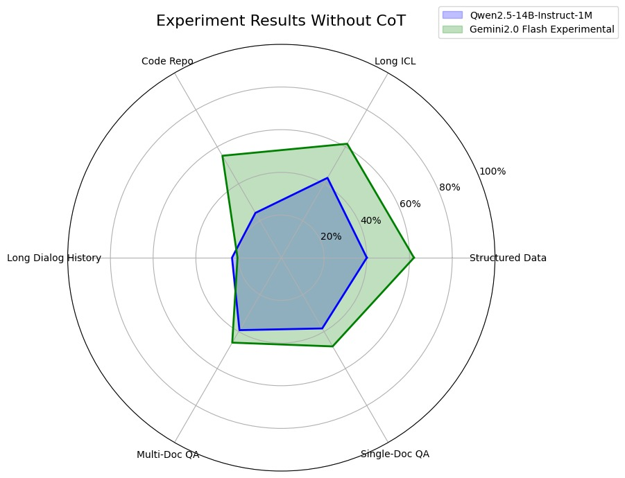
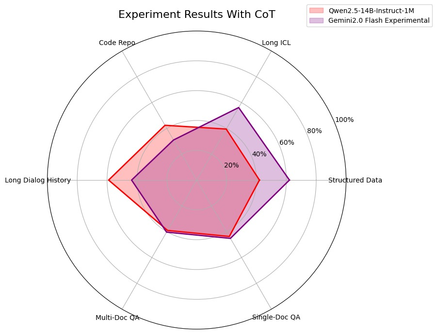

# 📚 LongBench v2: Towards Deeper Understanding and Reasoning on Realistic Long-context Multitasks

<p align="center">
    🌐 <a href="https://longbench2.github.io" target="_blank">Project Page</a> • 📚 <a href="https://arxiv.org/abs/2412.15204" target="_blank">LongBench v2 Paper</a> • 📊 <a href="https://huggingface.co/datasets/THUDM/LongBench-v2" target="_blank">LongBench v2 Dataset</a> • 𝕏 <a href="https://x.com/realYushiBai/status/1869946577349132766" target="_blank">Thread</a>
</p>
<p align="center">
    📖 <a href="https://arxiv.org/abs/2308.14508" target="_blank">LongBench Paper</a> • 🤗 <a href="https://huggingface.co/datasets/THUDM/LongBench" target="_blank">LongBench Dataset</a>
</p>

---

## 📌 Proje Açıklaması
Bu repoyu **LongBench v2** benchmark'ını daha geniş bir model desteğiyle çalıştırmak ve analiz etmek için fork ettim. Bu çalışma, büyük dil modellerinin uzun bağlamlardaki derin anlama ve akıl yürütme yeteneklerini değerlendirmek amacıyla gerçekleştirildi.

Bu sürümde **Gemini2.0 Flash Experimental** ve **Qwen2.5-14B-Instruct-1M** modelleri için destek ekledim. **`pred.py`** dosyasında yaptığım düzenlemeler sayesinde, artık Gemini API'leriyle de uyumlu çalıştırılabilir.

🔗 Orijinal repo: [THUDM/LongBenchv2](https://github.com/THUDM/LongBenchv2)

---

## ⚙️ Yeni Özellikler ve Güncellemeler

### Yeni Eklemeler:
1. **Genişletilmiş Model Desteği:**
   - **Gemini2.0 Flash Experimental** modeli için destek eklendi.
   - **Qwen2.5-14B-Instruct-1M** modeliyle optimizasyonlar yapıldı.

2. **`pred.py` Güncellemeleri:**
   - Varsayılan olarak `--nproc 16` kullanılmakta. Ancak, API'ye aşırı yüklenmeyi önlemek için `--nproc 2` parametresiyle çalıştırılması önerilir.
   - API çağrılarında hata durumunda **otomatik yeniden deneme** mekanizması eklendi.
   
3. **Analiz Çıktıları:**
   - **CoT (Chain-of-Thought) ile ve CoT olmadan** çalıştırılan model sonuçları karşılaştırıldı.

---

## 🔬 Deneysel Analizler

Bu çalışmada **Gemini2.0 Flash Experimental** ve **Qwen2.5-14B-Instruct-1M** modelleri kullanıldı. Aşağıdaki grafikler, **Chain-of-Thought (CoT) kullanılarak ve kullanılmadan** yapılan deney sonuçlarını göstermektedir:

### 1. CoT Olmadan Sonuçlar:


### 2. CoT ile Sonuçlar:


**Not:** Qwen modeli daha küçük bir parametre sayısına (14B) sahip olmasına rağmen, diğer büyük modellerle kıyaslandığında oldukça etkili sonuçlar vermektedir.

---

## 📊 Performans Tablosu

Aşağıda, LongBench v2 sıralamasına dair güncel performans sonuçları paylaşılmıştır. **Gemini2.0 Flash Experimental**, LongBench v2 liderlik tablosunda etkileyici bir sıralama elde etmiştir.

| Model                     | Params | Context  | Overall (%) | Easy (%) | Hard (%) | Short (%) | Medium (%) | Long (%) |
|---------------------------|--------|----------|-------------|----------|----------|-----------|------------|----------|
| Qwen2.5-14B (w/ CoT)     | 14B    | 1M       | 37.4        | 42.8     | 42.7     | 50.8      | 34.1       | 37.9     |
| Qwen2.5-14B (wo/ CoT)    | 14B    | 1M       | 29.0        | 35.5     | 33.0     | 41.3      | 29.0       | 29.0     |
| Gemini-2.0-Flash-Exp (w/ CoT) | 14B    | 1M       | 48.6        | 45.7     | 52.5     | 49.4      | 46.2       | 43.4     |
| Gemini-2.0-Flash-Exp (wo/ CoT)| 14B    | 1M       | 46.6        | 44.6     | 42.3     | 49.8      | 42.3       | 44.6     |

---

## ⚙️ Kullanım Talimatları

### Temel Kullanım
```sh
python pred.py --model gpt-4 --save_dir results
```

### Özel Ayarlar
Gemini ile çalıştırmak için:
```sh
python pred.py --model gemini-2.0-flash-exp --nproc 2
```

Qwen modeli için özel bir API URL'si:
```sh
python pred.py --model qwen --base_url http://custom-url.com/v1
```

---

## 📁 Çıktılar

- Tahminler `.jsonl` formatında kaydedilir.
- Çıktı örneği:
  ```json
  {
    "_id": "123",
    "question": "What is AI?",
    "response": "AI stands for Artificial Intelligence.",
    "pred": "B",
    "judge": true
  }
  ```

---
